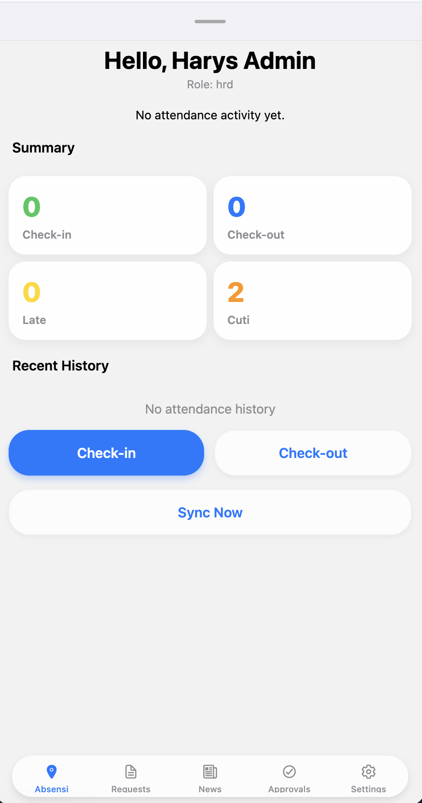
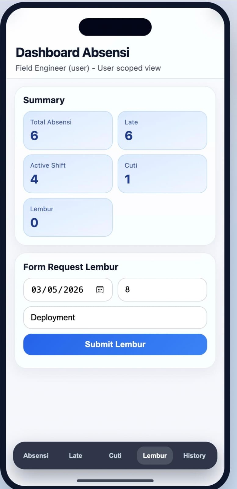
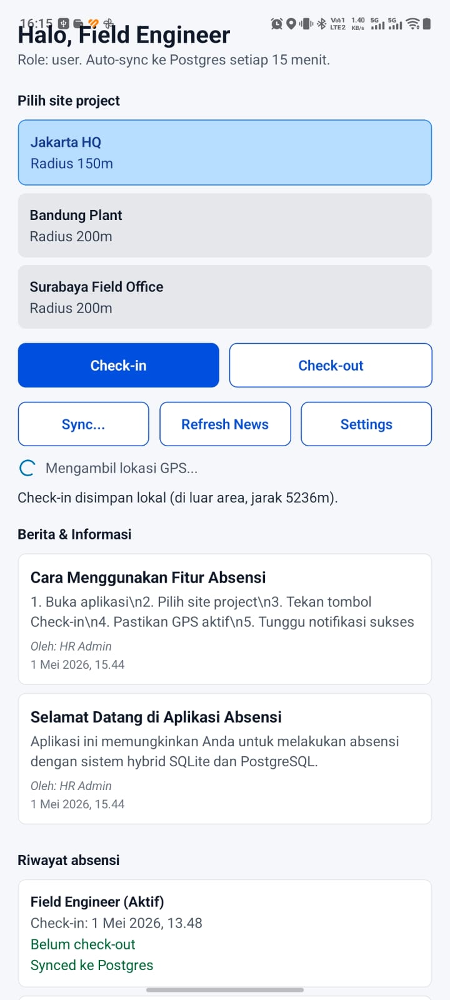
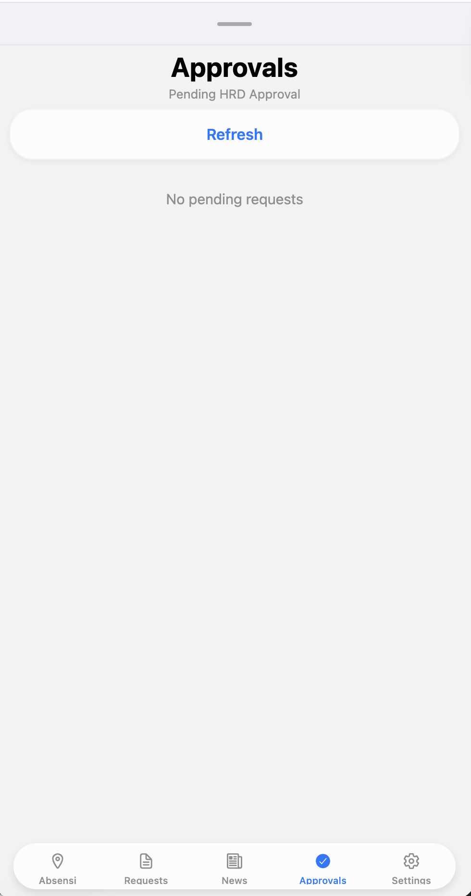
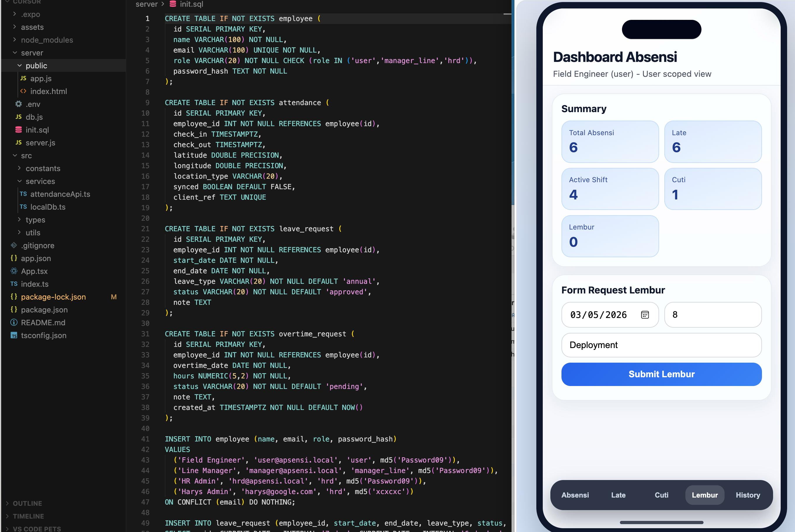
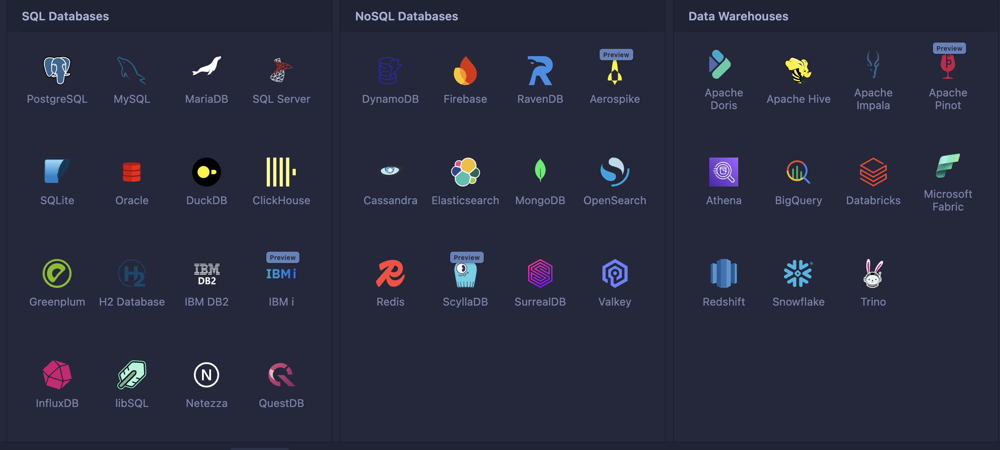

# Hybrid Attendance App - Android & Web

Aplikasi absensi hybrid menggunakan React Native dengan Expo, SQLite local database, dan PostgreSQL remote database dengan fitur auto-sync. Dilengkapi dengan UI iPhone-style dan validasi GPS yang lebih baik.

## 📱 Screenshots

### Mobile App (iPhone UI)





### Web Dashboard (iPhone Style)




## 🆕 What's New (Latest Update)

### 🔧 GPS & Attendance Fixes
- **GPS Timeout & Accuracy Validation** - 30s timeout, rejects accuracy >100m
- **Better Permission Handling** - Instructions to enable GPS in Settings
- **Server-side GPS Validation** - Haversine formula validates location server-side
- **Duplicate Check-in Prevention** - Backend blocks multiple active check-ins
- **UUID Generation** - Proper unique IDs instead of Math.random()

### 🎨 iPhone-Style UI
- **SF Pro Font** - Native iOS font family
- **iOS Colors** - #007AFF primary, #8e8e93 secondary, #f2f2f7 background
- **Card Shadows** - Proper elevation and blur effects
- **Calendar View** - Monthly calendar with attendance status dots
- **Tab Navigation** - Bottom tab bar with icons

### 👔 HRD Dashboard & Workflow
- **HRD Dashboard** - Statistics cards (Total, Late, Leave, Overtime)
- **Leave Approval Workflow** - pending_manager → pending_hrd → approved
- **Role-based Access** - User, Manager, HRD, Admin roles
- **Project Sites** - Jakarta HQ, Bandung Plant, Surabaya Field Office

## 📱 Fitur Utama

- **Android USB Debugging** - Dapat dijalankan di perangkat Android via USB
- **Local SQLite Database** - Data tersimpan lokal untuk mode offline
- **Remote PostgreSQL** - Sinkronisasi otomatis ke server
- **News Feature** - Menampilkan berita/informasi terbaru dengan auto-sync
- **Geofencing** - Validasi lokasi absensi berdasarkan radius site (server & client)
- **Offline-First** - Aplikasi tetap berjalan tanpa koneksi internet
- **Auto-Sync** - Sinkronisasi otomatis setiap 15 menit
- **iPhone-Style UI** - Interface mengikuti Human Interface Guidelines
- **Calendar View** - Riwayat absensi dalam tampilan kalender
- **HRD Dashboard** - Statistik dan approval cuti/lembur
- **Server Connection Settings** - Konfigurasi koneksi server yang fleksibel

## 🏗️ Arsitektur

```
┌─────────────────┐
│  React Native  │
│   (Expo App)   │
└────────┬────────┘
         │
    ┌────┴────┐
    │         │
┌───▼───┐ ┌─▼─────┐
│ SQLite │ │ API    │
│ (Local)│ │ Server │
└────────┘ └──┬────┘
                 │
            ┌────▼────┐
            │PostgreSQL│
            │ (Remote) │
            └─────────┘
```

## 📋 Prerequisites

- Node.js (v18+)
- npm atau yarn
- PostgreSQL (v12+)
- Expo CLI (`npm install -g expo-cli`)
- Android Studio (untuk Android build)
- ADB (Android Debug Bridge)

## 🚀 Instalasi & Menjalankan

### 1. Clone Repository

```bash
git clone https://github.com/harysrifai/Android-absensi-ReactNative.git
cd Android-absensi-ReactNative
```

### 2. Install Dependencies

```bash
# Install app dependencies
npm install

# Install server dependencies
cd server && npm install && cd ..
```

### 3. Setup Database PostgreSQL

```bash
# Buat database
createdb apsensi_db

# Jalankan script inisialisasi
npm run db:init
```

### 4. Konfigurasi Environment

Buat file `server/.env`:

```env
PGHOST=localhost
PGPORT=5432
PGDATABASE=apsensi_db
PGUSER=postgres
PGPASSWORD=Password09
API_PORT=4000
```

### 5. Menjalankan Aplikasi

**Cara Paling Mudah - Gunakan Script:**

```bash
chmod +x run-app.sh
./run-app.sh
```

**Manual - Start Server:**

```bash
# Terminal 1: Start API Server
cd server
node server.js
# Server berjalan di http://0.0.0.0:4000
```

**Manual - Start Expo:**

```bash
# Terminal 2: Start Expo
npx expo start

# Untuk Android:
npx expo start --android

# Untuk Web:
npx expo start --web
```

## 📱 Menjalankan di Android via USB Debugging

### Setup ADB Reverse (Recommended):

```bash
# Hubungkan Android via USB, aktifkan USB Debugging
adb reverse tcp:4000 tcp:4000
```

Dengan ADB reverse, Android dapat mengakses `http://localhost:4000` yang akan diteruskan ke komputer.

### Tanpa ADB Reverse (Gunakan IP Address):

Jika ADB reverse tidak bekerja, gunakan IP address komputer:

1. Cek IP address komputer:
   ```bash
   ifconfig | grep "inet " | grep -v 127.0.0.1
   ```

2. Buka aplikasi, masuk ke **Settings** (ikon pengaturan)

3. Masukkan IP address (contoh: `http://192.168.1.21:4000`)

4. Save dan restart aplikasi

## 🔧 Server Connection Settings

Aplikasi memiliki fitur **Server Connection Settings** untuk mengatur koneksi ke server:

- **Default:** `http://10.0.2.2:4000` (Android Emulator) atau `http://localhost:4000` (Web)
- **Custom URL:** Dapat diubah via Settings screen
- **Disimpan di SQLite:** Pengaturan tersimpan lokal
- **Auto-load:** Saat aplikasi dibuka, URL akan dimuat dari database

### Cara Mengubah Server URL:

1. Login ke aplikasi
2. Scroll ke bawah, klik tombol **"Settings"**
3. Masukkan URL server (contoh: `http://192.168.1.21:4000`)
4. Klik **"Save"**
5. Restart aplikasi

## 🗄️ Struktur Database

### PostgreSQL (Remote)

```sql
- employee (id, name, email, role, password_hash)
- attendance (id, employee_id, check_in, check_out, latitude, longitude, location_type, synced, client_ref)
- leave_request (id, employee_id, start_date, end_date, leave_type, status, note, manager_approved_by, manager_approved_at, hrd_approved_by, hrd_approved_at)
- overtime_request (id, employee_id, overtime_date, hours, status, note, created_at)
- news (id, title, content, image_url, author_id, published_at, is_active)
- server_config (id, key, value, updated_at)
```

### SQLite (Local)

```sql
- employee (id, name, email, role, password_hash)
- attendance (id, employee_id, check_in, check_out, latitude, longitude, location_type, synced, client_ref)
- sync_log (id, attendance_client_ref, status, message, created_at)
- news (id, remote_id, title, content, image_url, author_name, published_at, synced)
- server_config (id, key, value, updated_at)
```

## 👤 Demo Accounts

| Email | Password | Role |
|-------|----------|------|
| user@apsensi.local | Password09 | user |
| manager@apsensi.local | Password09 | manager_line |
| hrd@apsensi.local | Password09 | hrd |
| harys@google.com | xcxcxc | hrd |

## 🔄 Alur Sinkronisasi

### Basic Flow
1. **Check-in/Check-out** → Disimpan di SQLite lokal
2. **Auto-sync timer** → Setiap 15 menit, aplikasi mencoba sync ke server
3. **Manual sync** → User dapat menekan tombol "Sync Sekarang"
4. **Sync process** → Data dari SQLite dikirim ke PostgreSQL via API
5. **Mark as synced** → Setelah berhasil, data di SQLite diupdate `synced=1`

### Offline & Online Sync Flow (Detailed)

#### 1. App Start / Init
- Buat database lokal SQLite di perangkat
- Simpan semua config (user, role, absensi, setting)
- Gunakan kredensial default:
  - User: [NEON_USER]
  - Password: Password09

#### 2. Default Mode (Offline-first)
- Semua query dibaca dari SQLite
- Jika tidak ada koneksi:
  - Data user, config, absensi, dan temp data tetap disimpan di SQLite
  - Postgres tidak diakses langsung
- SQLite berfungsi sebagai cache + storage sementara

#### 3. Sync Job (Online Mode)
- Saat koneksi tersedia:
  - Jalankan sync service → kirim data baru dari SQLite ke Postgres
  - Postgres tetap menjadi master database
  - Koneksi utama:
    - Host: localhost
    - Port: 5432
    - DB: apsensi_db
    - User: postgres
    - Password: Password09

#### 4. Postgres → Neon Backup
- Postgres akan melakukan replication/backup ke Neon:
  - Host: [NEON_HOST]
  - DB: apsensi_db
  - User: [NEON_USER]
  - Password: [NEON_PASSWORD]
  - Port: 5432

#### 5. Sync Flow Detail
1. Ambil data dari SQLite dengan flag synced=0
2. Push ke Postgres via API
3. Jika sukses → update flag synced=1 di SQLite
4. Buat log absensi hanya untuk user yang sign in
5. Sinkronisasi dilakukan periodik (misalnya setiap 1 menit dengan cron job / background worker)

**Catatan Teknis:**
- SQLite hanya cache → jangan dipakai untuk audit final
- Postgres master → semua validasi & compliance tetap di sini
- Neon backup → redundancy & disaster recovery
- API layer → wajib ada untuk komunikasi aman (jangan direct DB connect dari mobile)

## 📰 News Feature

- News ditampilkan di beranda aplikasi
- Auto-sync setiap 15 menit
- News disimpan di SQLite untuk mode offline
- HRD dapat menambah news via API: `POST /news/create`

### API News:

```bash
# Get all news
GET http://localhost:4000/news

# Create news (HRD only)
POST http://localhost:4000/news/create
Body: {
  "title": "Judul Berita",
  "content": "Isi berita...",
  "image_url": "https://example.com/image.jpg",
  "author_id": 3
}
```

## 📅 Calendar Feature (React Native)

### 🕒 Timezone
- Semua tanggal dan waktu menggunakan **UTC+7 (WIB)**
- Sinkronisasi otomatis dengan perangkat pengguna

### 📌 Format Tampilan
- **Hari** ditampilkan di baris atas (Senin, Selasa, dst)
- **Tanggal** ditampilkan di baris bawah sesuai kalender nasional Indonesia
- **Hari Libur Nasional** ditampilkan dengan **teks merah**

Contoh:
```
Senin   Selasa   Rabu   Kamis   Jumat   Sabtu   Minggu
1       2        3      4       5       6       7
```

### 🎨 Legend Status Absensi
- **Check-in** → 🟢 Hijau
- **Check-out** → 🔵 Biru
- **Late** → 🟡 Kuning
- **No Check-in** → 🟠 Oranye
- **No Check-out** → 🟣 Ungu
- **Holiday (Libur Nasional)** → 🔴 Teks Merah

### 📂 Struktur Data
```json
{
  "date": "2026-05-02",
  "day": "Sabtu",
  "holiday": true,
  "attendance": {
    "check_in": "08:15",
    "check_out": "17:00",
    "status": "Late"
  },
  "color": "#FFD700"
}
```

### 🔄 Integrasi
- Backend API mengembalikan data absensi per tanggal
- Frontend React Native menampilkan kalender dengan warna sesuai legend
- Hari libur nasional diambil dari API Kemenaker atau file JSON lokal

## 🌐 API Endpoints

| Endpoint | Method | Description |
|----------|--------|-------------|
| `/` | GET | API info |
| `/health` | GET | Health check |
| `/auth/login` | POST | User login |
| `/attendance` | GET | Get attendance records |
| `/attendance/check-in` | POST | Check-in (with GPS validation) |
| `/attendance/check-out` | POST | Check-out (with GPS validation) |
| `/attendance/late` | GET | Get late attendance |
| `/leave` | GET | Get leave requests |
| `/leave/request` | POST | Submit leave request |
| `/leave/approve-manager/:id` | POST | Manager approval |
| `/leave/approve-hrd/:id` | POST | HRD approval |
| `/overtime` | GET | Get overtime requests |
| `/overtime/request` | POST | Submit overtime request |
| `/dashboard` | GET | Get dashboard summary (HRD) |
| `/sync/attendance` | POST | Sync local to remote |
| `/news` | GET | Get news list |
| `/news/create` | POST | Create new news |
| `/attendance/export` | GET | Export to CSV (HRD) |

## 🖼️ Folder Structure (Screenshots)

```
imgs/
├── mobile-login.png          # Mobile login screen
├── mobile-attendance.png     # Mobile attendance with site selection
├── mobile-calendar.png       # Calendar view with attendance dots
├── mobile-dashboard.png      # HRD dashboard with statistics
├── mobile-history.png        # Attendance history list
├── mobile-settings.png       # Server settings screen
├── web-login.png            # Web login page
├── web-dashboard.png         # Web HRD dashboard
├── web-calendar.png         # Web calendar view
└── web-attendance.png       # Web attendance page
```

Untuk menambahkan screenshot:
1. Ambil screenshot aplikasi (Cmd+Shift+4 di macOS)
2. Rename sesuai daftar di atas
3. Masukkan ke folder `imgs/`
4. Push ke repository

## 🐛 Troubleshooting

### Android: "Network Request Failed"

**Penyebab:** Android tidak dapat mengakses server di localhost/127.0.0.1

**Solusi:**

1. **Gunakan ADB Reverse:**
   ```bash
   adb reverse tcp:4000 tcp:4000
   ```
   Kemudian akses via `http://localhost:4000` di Android

2. **Gunakan IP Address (jika ADB reverse tidak work):**
   - Cek IP komputer: `ifconfig | grep inet`
   - Buka aplikasi → Settings
   - Masukkan: `http://192.168.1.21:4000` (sesuaikan dengan IP Anda)
   - Save & Restart

3. **Pastikan server berjalan di `0.0.0.0:4000`** (bukan localhost saja):
   ```bash
   # Di server/server.js sudah dikonfigurasi:
   app.listen(PORT, "0.0.0.0", ...)
   ```

4. **Cek Firewall:** Pastikan port 4000 tidak diblokir firewall

5. **Pastikan Android dan komputer di jaringan WiFi yang sama** (jika menggunakan IP address)

### GPS Issues

**GPS Timeout / Low Accuracy:**
- Pastikan GPS aktif dan izinkan akses lokasi
- Coba di area terbuka (luar ruangan)
- Accuracy >100m akan menampilkan peringatan
- Timeout 30 detik jika GPS tidak mendapat sinyal

**Location Type Mismatch:**
- Server melakukan validasi ulang lokasi (server-side validation)
- Response mencakup `server_location_type` dan `distance_to_site`

### Server tidak bisa diakses

```bash
# Cek apakah server berjalan
curl http://localhost:4000/health

# Cek port yang digunakan
lsof -i :4000

# Kill process jika perlu
kill -9 $(lsof -ti :4000)
```

## 📦 Build Android APK

```bash
# Build untuk Android
eas build --platform android

# Atau jika menggunakan expo build (legacy):
expo build:android
```

## 📄 Scripts

| Script | Description |
|--------|-------------|
| `npm start` | Start Expo development server |
| `npm run android` | Run on Android device/emulator |
| `npm run ios` | Run on iOS simulator |
| `npm run web` | Run on web browser |
| `npm run api` | Start API server |
| `npm run db:init` | Initialize PostgreSQL database |
| `./run-app.sh` | Interactive launcher (API + Expo) |

## 🤝 Contributing

1. Fork repository
2. Create feature branch (`git checkout -b feature/AmazingFeature`)
3. Commit changes (`git commit -m 'Add some AmazingFeature'`)
4. Push to branch (`git push origin feature/AmazingFeature`)
5. Open Pull Request

## 📝 License

MIT License

## 📞 Contact

Harys Rifai - harysrifai@gmail.com

Project Link: https://github.com/harysrifai/Android-absensi-ReactNative

## 🙏 Acknowledgments

- React Native & Expo Team
- PostgreSQL Global Development Group
- Expo Location for GPS functionality
- SF Pro Font by Apple Inc.
